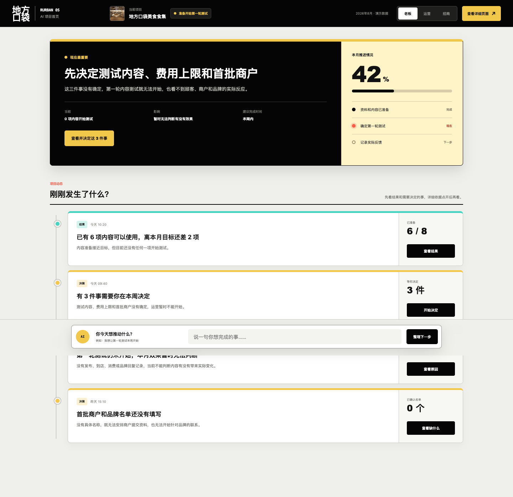
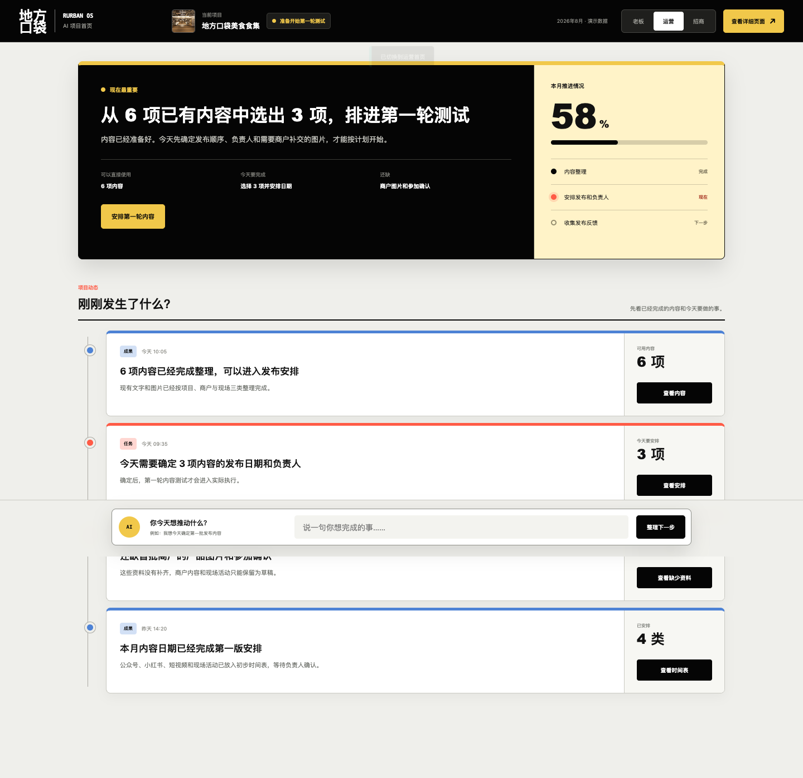
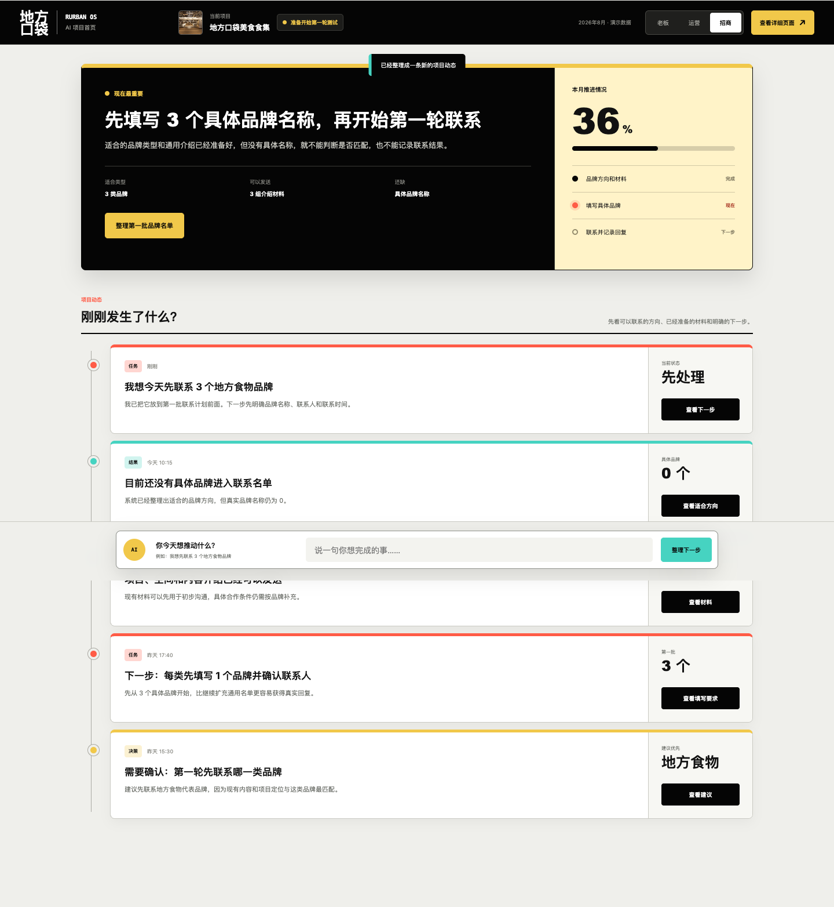

# Rurban OS AI 原生首页实验页

> 本页是独立首页实验，不替换现有四角色高级详情页。  
> 使用固定演示数据，不连接数据库、不调用 AI 服务、不保存输入。

## 固定入口

- [打开可交互实验页](https://elomacken-sketch.github.io/rurban-os-role-review/home/)
- [返回现有高级详情页](https://elomacken-sketch.github.io/rurban-os-role-review/app/)

## 页面规则

首页没有左侧导航，只保留当前项目和状态、一条“现在最重要”的行动卡、项目动态和“你今天想推动什么？”输入框。

项目动态只出现四种卡片：结果、决策、成果、任务。每张卡片只有一个主要按钮。

- 老板默认看结果和决策。
- 运营默认看成果和任务。
- 招商默认看品牌联系、可发送材料和下一步。
- 商户不进入内部首页，仍通过现有独立任务页面完成事项。

## 老板首页

重点：先决定测试内容、费用上限和首批商户。

## 运营首页

重点：从 6 项已有内容中选出 3 项，排进第一轮测试。

## 招商首页

重点：先填写 3 个具体品牌名称，再开始第一轮联系。

## 可交互内容

1. 切换老板、运营和招商首页。
2. 打开“现在最重要”的详细内容。
3. 打开任意动态卡片的详细依据。
4. 在输入框写一句想推动的事，页面会将它整理成一条新的结果、决策或任务卡。
5. 点击“查看详细页面”回到现有四角色高级详情页。

