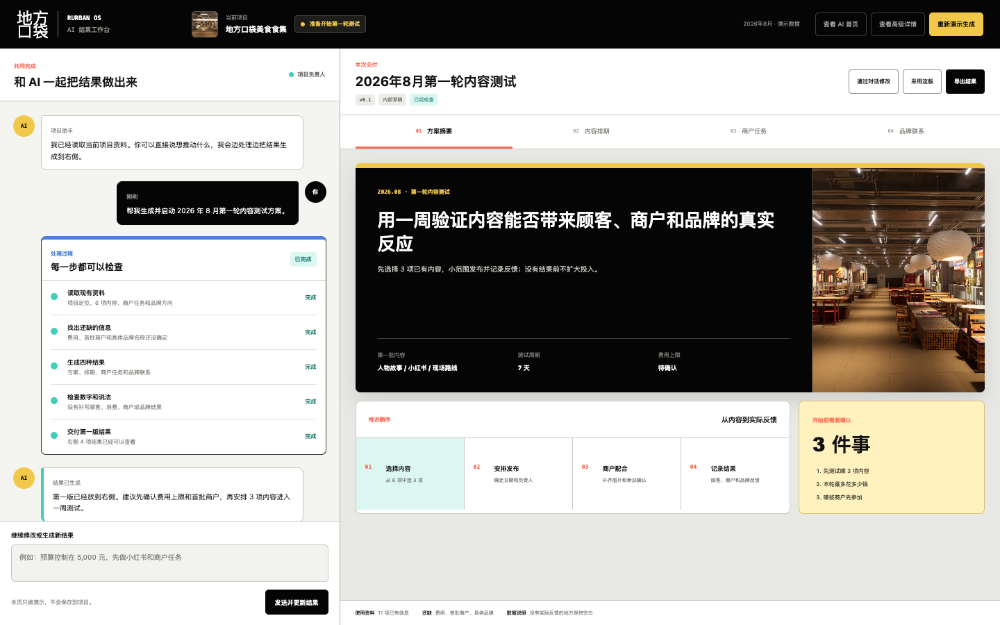
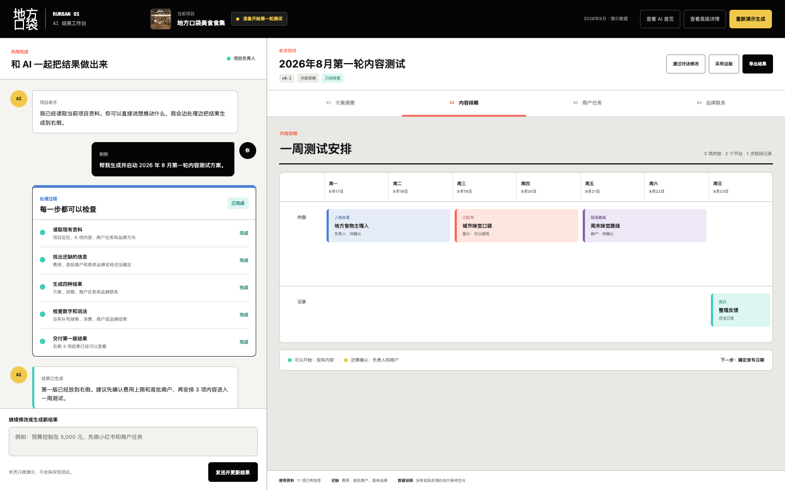
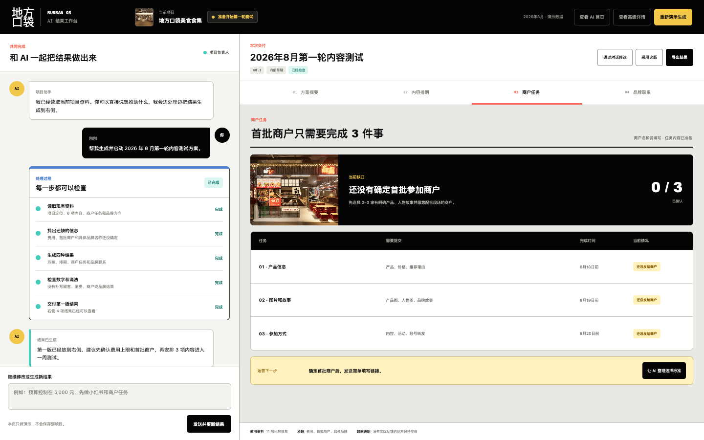
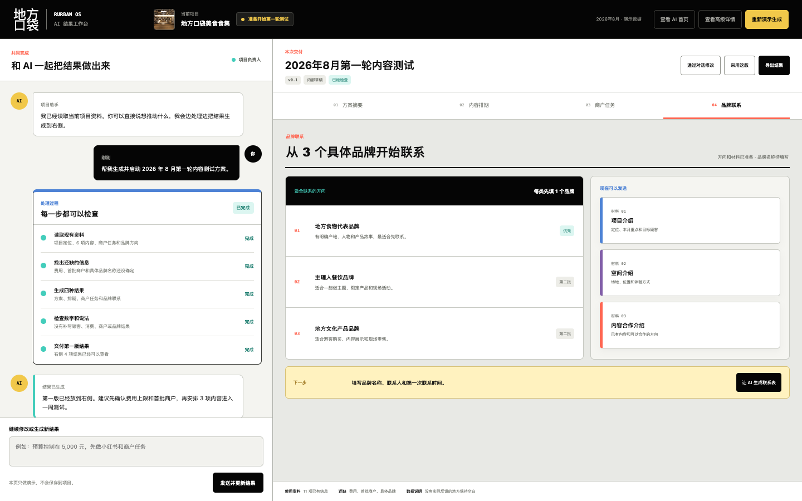
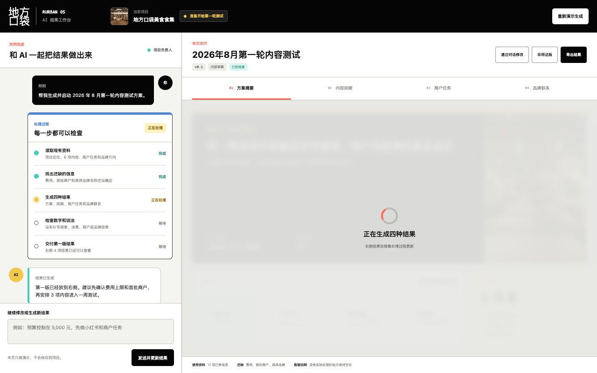

# Rurban OS 对话与结果双画布实验

> 本页用于验证“聊天推进 + 可见处理过程 + 多形式结果交付”。  
> 它是独立实验页，不替换现有 AI 首页和四角色高级详情页。  
> 使用固定演示数据，不连接数据库、不调用 AI 服务、不保存输入。

## 固定入口

- [打开可交互实验页](https://elomacken-sketch.github.io/rurban-os-role-review/workspace/)
- [查看上一版 AI 首页](https://elomacken-sketch.github.io/rurban-os-role-review/home/)
- [查看现有高级详情页](https://elomacken-sketch.github.io/rurban-os-role-review/app/)

## 本轮验证什么

左侧是用户与 AI 的对话，以及可以逐项检查的处理步骤；右侧是同步生成的正式结果。用户不需要先找功能，只需说出想推动的事情。

处理过程展示：读取了什么、还缺什么、正在生成什么、检查了什么、最终交付什么。页面不展示冗长且不可核验的模型内部推理。

同一次生成交付四种不同形式：

1. 方案摘要：简报式页面；
2. 内容排期：一周日历；
3. 商户任务：任务表；
4. 品牌联系：品牌方向和可发送材料。

## 1. 方案摘要

## 2. 内容排期

## 3. 商户任务

## 4. 品牌联系

## 5. 生成过程

点击“重新演示生成”后，左侧逐项更新当前步骤，右侧显示正在生成的结果。

## 可测试操作

1. 切换四种结果；
2. 点击“重新演示生成”查看完整处理过程；
3. 在左侧输入修改要求，生成新版本；
4. 点击快速修改建议，将费用更新为 5,000 元以内；
5. 标记采用当前版本；
6. 把当前结果导出为 Markdown 文件。

