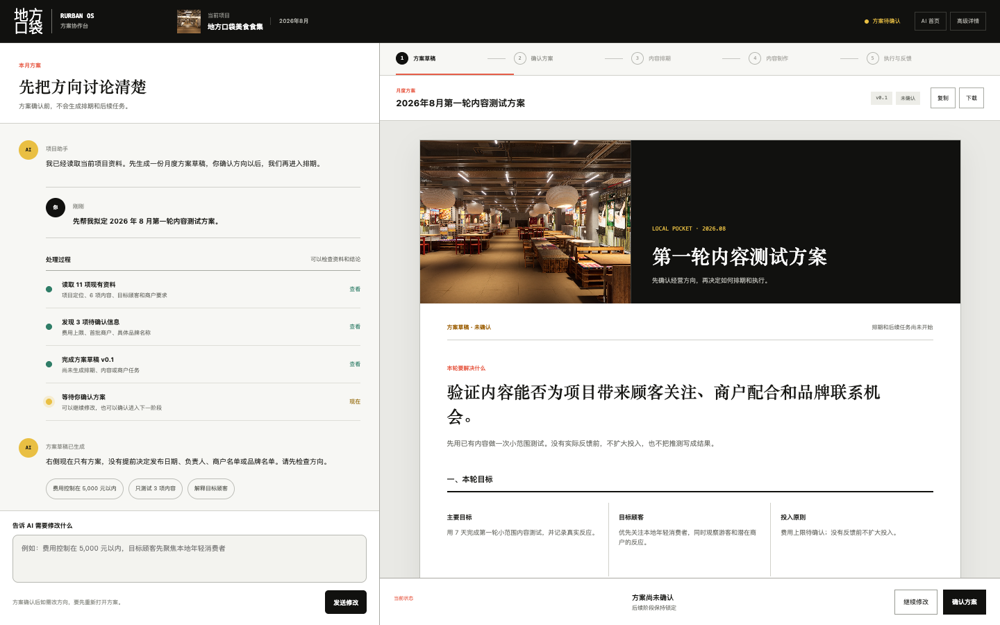
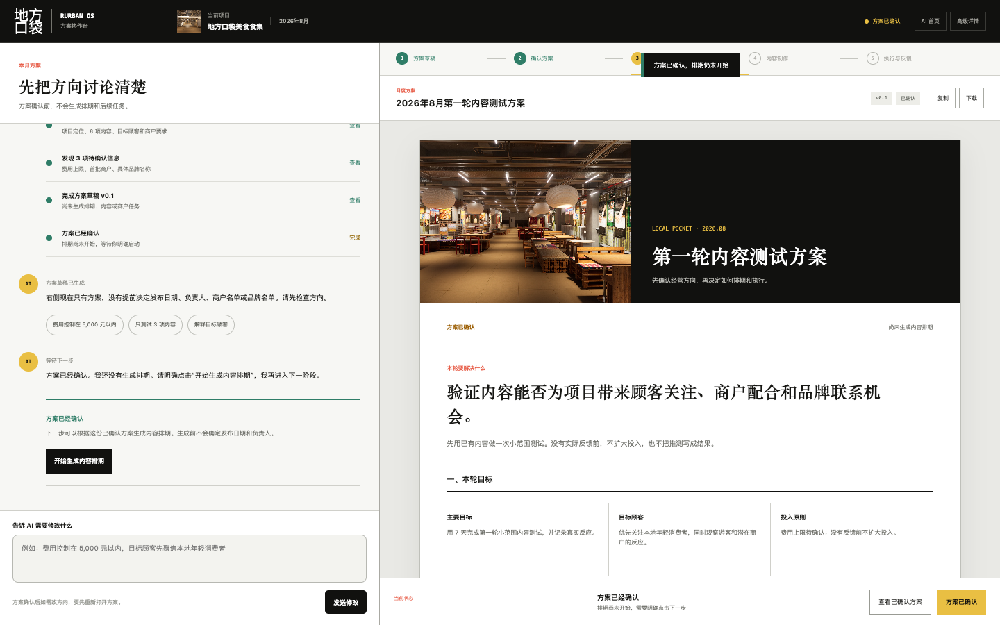
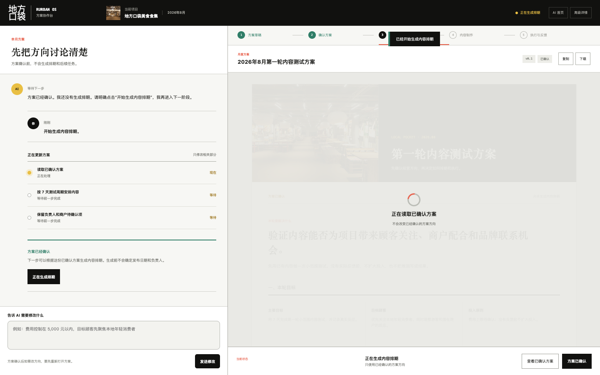
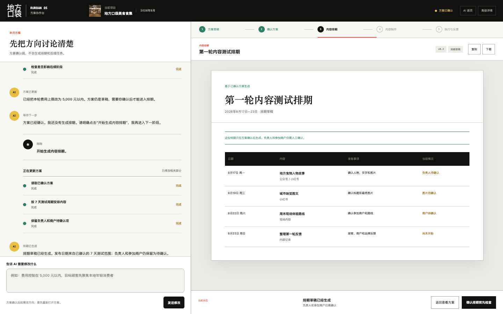

# Rurban OS 方案协作台实验

> 当前版本以 Claude Artifacts 的信息架构为参考：左侧通过对话修改，右侧一次只显示一个可独立使用的结果。
> 不使用卡片墙，不提前生成下游结果。
> 使用固定演示数据，不连接数据库、不调用 AI 服务、不保存输入。

## 固定入口

- [打开可交互实验页](https://elomacken-sketch.github.io/rurban-os-role-review/workspace/)
- [查看上一版 AI 首页](https://elomacken-sketch.github.io/rurban-os-role-review/home/)
- [查看现有高级详情页](https://elomacken-sketch.github.io/rurban-os-role-review/app/)

## 强制顺序

1. AI 读取现有资料并生成方案草稿；
2. 用户通过对话继续修改方案；
3. 用户明确点击“确认方案”；
4. 内容排期只显示为“可以开始”，此时仍没有排期结果；
5. 用户再次点击“开始生成内容排期”；
6. AI 才根据已确认方案生成排期草稿；
7. 内容制作、商户任务和品牌联系继续锁定，本轮不提前生成。

## 1. 方案草稿

右侧只有一份正式方案文档，没有排期、商户任务和品牌联系结果。

## 2. 方案确认后

方案已确认，内容排期显示为“可以开始”，排期内容仍为 0。

## 3. 排期生成中

用户明确点击开始后，左侧显示处理步骤，右侧显示正在根据已确认方案生成。

## 4. 排期生成后

排期只包含 7 天测试范围内的内容；负责人和参加商户继续保留为待确认。

## 可测试操作

1. 通过左侧对话修改方案并生成新版本；
2. 查看 AI 使用了什么资料、发现哪些缺口；
3. 确认方案并检查排期仍未生成；
4. 明确启动排期生成；
5. 复制或下载当前结果。
