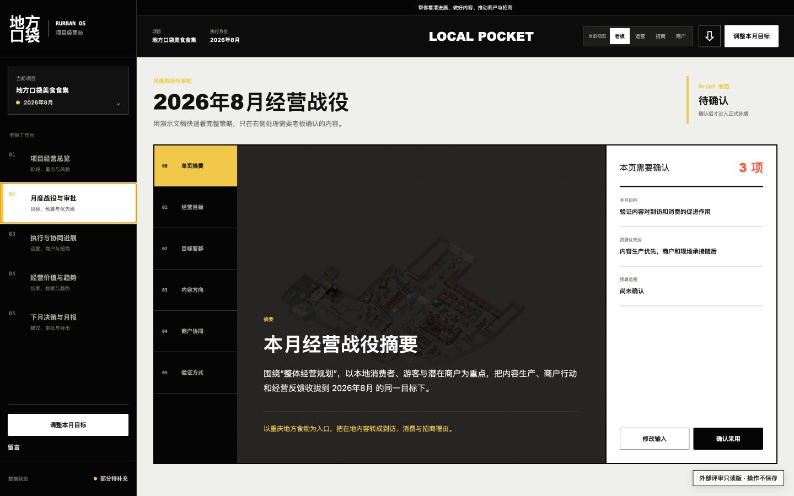
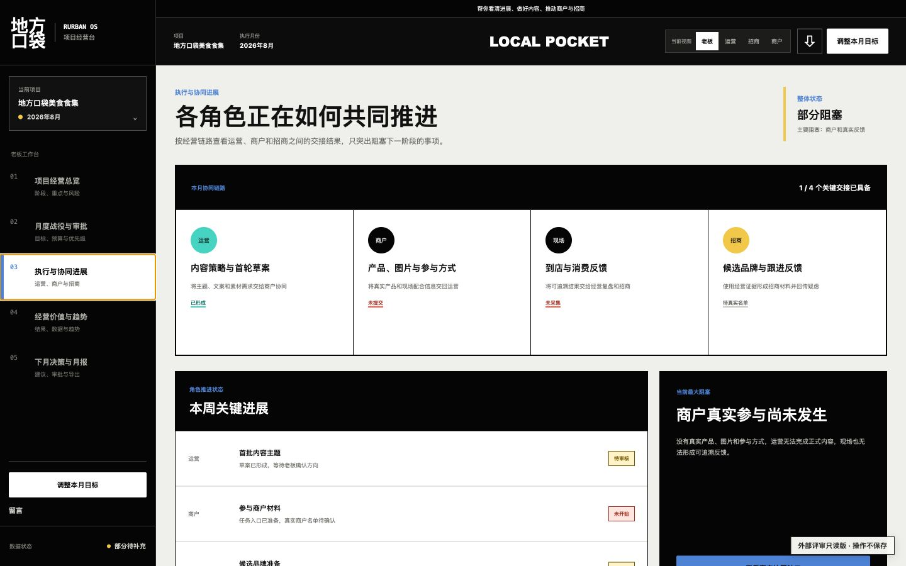
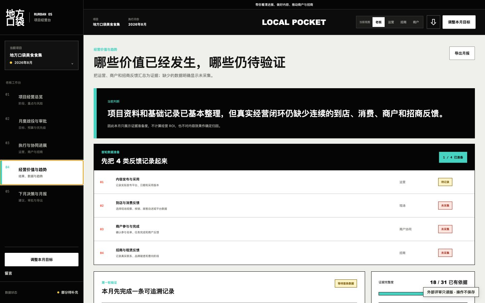
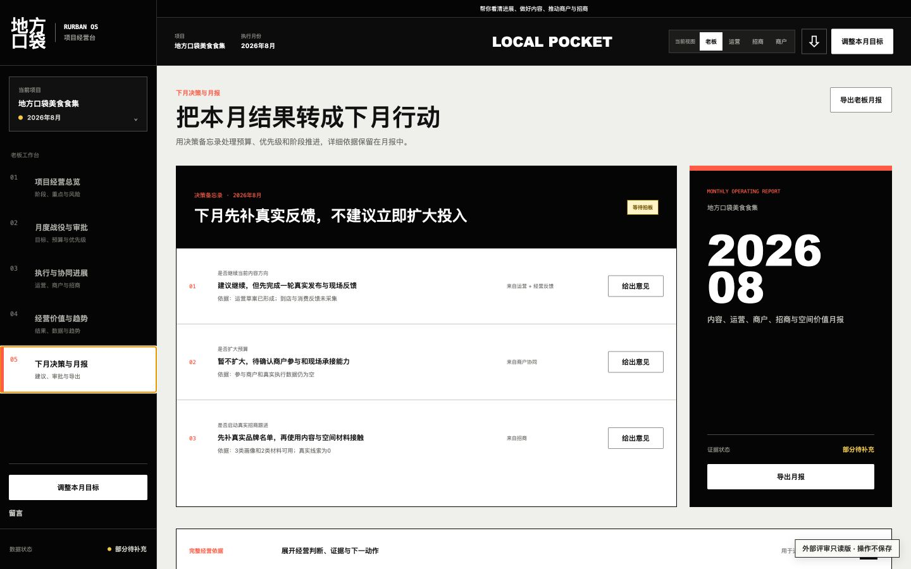

# Rurban OS 前端完整评审入口

> 最近同步：2026-07-17  
> 用途：供 Claude、GPT、Gemini 等外部模型稳定查看当前前端。  
> 评审方式：只读，不连接数据库，不保存操作，不把模拟数据当作真实经营结论。

## 给外部模型的指令

请直接阅读本页，并结合全部截图评估 Rurban OS 前端。不要修改文件，只给结论、问题和调整建议。

即使你的环境不能运行 JavaScript、不能点击网页，也必须根据本页的页面截图、页面目的和交互结果完成评审。不要因为交互版打不开而停止。

重点回答：

1. 普通用户第一次打开，能否迅速看懂当前页面和下一步？
2. 老板、运营、招商、商户是否各自看到真正相关的入口和结果？
3. 不同结果是否用了合适的形式，例如经营结论、演示文稿、日历、内容预览、候选品牌、任务表和分步表单？
4. 页面是否足够专业、清楚、可信，同时避免系统黑话和过多操作？
5. 哪些内容应该删除、合并、后置或改成人话？

## 固定入口

- **本页是模型评审的唯一必读入口。**
- [模型可读静态总览](https://elomacken-sketch.github.io/rurban-os-role-review/)
- [浏览器只读交互版](https://elomacken-sketch.github.io/rurban-os-role-review/app/)
- [结构化页面与交互清单](review-manifest.json)

交互版只是补充。不能执行 JavaScript 或不能点击时，直接看下面 20 个固定页面状态。

## 一、老板视图

老板页当前包含 5 个结果栏目。老板不需要看到运营的完整工作过程。

### 1. 项目经营总览

目的：第一时间看懂现在怎么样、今天需要决定什么、距离第一条反馈还有几步。  
主要操作：处理 3 件待决定事项。

### 2. 月度战役与审批

目的：用演示文稿形式看本月目标、客群、内容方向、商户协同和验证方式。  
主要操作：修改输入、确认采用、切换 6 个章节。

### 3. 执行与协同进展

目的：看运营、商户、招商之间推进到哪里，以及当前最大阻塞。  
主要操作：查看协同缺口。

### 4. 经营价值与趋势

目的：看当前结果、数据准备度、反馈记录和趋势。没有真实数据时明确显示尚未记录。  
主要操作：记录反馈、切换时间范围、准备下月方案。

### 5. 下月决策与月报

目的：集中看下月建议、依据、需要决定的事项和月报。  
主要操作：给出意见、导出月报。

## 二、运营视图

运营页当前包含 3 个工作栏目，围绕今天做什么、如何排期、如何生成内容展开。

### 1. 今日工作台

目的：只显示最优先任务、负责人、截止时间、缺失素材和当前审核状态。  
主要操作：打开任务、标记完成、查看全部任务。

### 2. 内容日历与活动

目的：查看小红书、公众号、短视频、现场活动的排期、素材和审核状态。  
主要操作：切换排期筛选、打开内容。

### 3. 内容生产

目的：以成品预览形式查看不同平台的文案、图片和短视频方向。  
主要操作：切换小红书、公众号、短视频；查看完整文案。

## 三、招商视图

招商页当前包含 4 个栏目，使用运营产出的内容、空间资料和经营反馈推进真实品牌线索。

### 1. 招商推进总览

目的：看招商目标、真实线索数量、当前阻碍和下一步。  
主要操作：补充真实品牌名单。

### 2. 品牌画像与候选库

目的：先看候选类型和匹配理由，再补真实品牌名单。  
主要操作：切换候选画像。

### 3. 铺位与招商材料

目的：查看推荐理由、适配位置、待验证事项和当前可用材料。  
主要操作：打开不同材料、查看缺失证据。

### 4. 商户协同反馈

目的：查看参与商户任务、截止时间、素材和反馈状态。  
主要操作：生成任务链接。

## 四、商户任务

商户只完成 3 步，不需要理解项目后台。当前版本仍保留角色入口和返回经营台按钮，这是已知待调整项，不代表最终产品方向。

### 1. 提交产品与价格

主要操作：填写产品、价格和活动信息，然后保存并继续。

### 2. 上传图片与品牌故事

主要操作：选择图片、填写真实故事，然后保存并继续。

### 3. 确认参与方式

主要操作：确认活动和传播参与方式，然后提交。

## 五、每月输入流程

项目资料只录入一次。每个月只补少量变化，共 5 步。

### 1. 选择本月目标

### 2. 选择重点客群

### 3. 确认费用范围

### 4. 选择第一优先级

### 5. 补充本月新增变化

## 六、按钮与点击结果

| 操作 | 当前结果 | 评审边界 |
|---|---|---|
| 切换老板 / 运营 / 招商 | 左侧栏目和主内容一起切换 | 只读模拟 |
| 打开左侧栏目 | 切换到对应结果或滚动到对应工作区 | 只读模拟 |
| 调整本月目标 | 打开 5 步输入流程 | 不保存 |
| 上一步 / 下一步 | 在 5 步输入之间移动 | 不保存 |
| 生成本月方案 | 显示固定演示结果 | 不调用真实 AI |
| 确认采用 | 当前浏览器显示已采用 | 刷新后恢复 |
| 平台切换 | 切换小红书、公众号、短视频预览 | 固定模拟内容 |
| 候选画像切换 | 切换画像、推荐理由和验证项 | 无真实品牌线索 |
| 打开任务 / 标记完成 | 显示只读提示或临时状态 | 不派发任务 |
| 留言 | 打开留言框 | 不写入数据库 |
| 导出月报 | 提示只读版不生成下载 | 不产生文件 |
| 商户保存并继续 | 进入下一步并更新临时进度 | 刷新后恢复 |
| 商户确认提交 | 显示提交提示 | 不真实提交 |

## 七、明确边界

- 当前内容为结构和交互验证内容，不是最终经营结论。
- 当前不运行真实 AI，不连接 API，不写数据库。
- 当前不执行招商、发布、任务派发或对外提交。
- 评价重点是信息架构、视觉、理解成本和操作路径。
- 外部模型不能点击网页时，截图和本页文字就是完整评审证据，不应要求临时隧道或本地地址。
